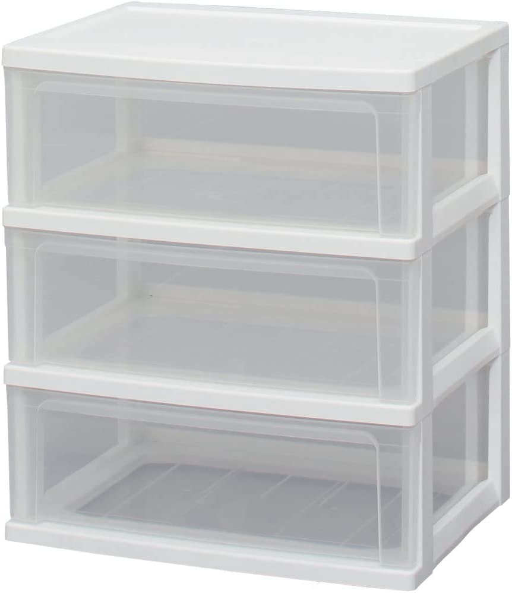

# コーディング専攻<br>ライブ授業
<h2 class="firstPage">2週目「JavaScript」</h2>


---

1. 座学
1. 実習
1. まとめ

---

座学の時間
## JavaScript

---

空のHTMLファイルを用意して

---

### 変数スコープ

--

スコープとは参照できる範囲のこと

--

ところで“変数宣言”何があった？

--

宣言 | 内容
-------------|---------------
何もつけない      | グローバル
var      | 関数　再宣言可
let      | ブロック　再宣言不可
const      | ブロック　再宣言不可　定数
[変数宣言の種類]

--

スコープの種類

```txt
├── グローバルスコープ
└── ローカルスコープ
    ├──関数スコープ
    └──ブロックスコープ
```

--

実際に体験してみよう

---


### 配列

--

変数の一種  
複数の値をまとめて管理、格納できる

--

衣装ケースをイメージしてみて

<p><p/>

- Tシャツ
- パンツ
- 靴下

※1つの段にはひとつしかもの（値）が入らないよ

--

#### 配列の書き方

配列名 = [要素1, 要素2, 要素3,　…];

```js
wardrobe = ["Tシャツ", "パンツ", "靴下"]
```

--

#### 参照するには

全部の値：配列名;

```js
wardrobe
```

値を一つだけ：配列名[添え字];

```js
wardrobe[0]
```

※添え字は数字で0から始まります

--

記述 | 内容 | 例
-------------|---------------|---------------
length | 要素の数を調べる | wardrobe.length
push() | 最後に要素を追加 | wardrobe.push("ズボン")
pop() | 最後の要素を削除 | wardrobe.pop()
unshift()| 最初に要素を追加 | wardrobe.unshift("ハンカチ")
shift() | 最初の要素を削除 | wardrobe.shift()
[配列の操作1]

--

記述 | 内容 | 例
-------------|---------------|---------------
slice() | コピーするときなど | 後述
splice() | 任意の位置で追加や削除 | 後述
[配列の操作2]

--

```js
/**
 * slice(コピー開始の位置,コピー終了の位置+1)
 */

//a = wardrobe.slice(1,2);//1番目の要素から1番目の要素までをコピー
a = wardrobe.slice(1,4);//1番目の要素から3番目の要素までをコピー
console.log("sliceの結果：" + a);

```

--

```js
/**
 * splice(削除開始の位置,削除する要素数)
 */

wardrobe.splice(0, 1);// 0番目から1つの要素を消す
console.log("spliceの結果：" + wardrobe);

// 2番目から1つも要素を消さないで、その位置の後ろに要素を追加
letterCase.splice(2, 0, "ズボン");
console.log("spliceの結果2：" + wardrobe);

```

---

### API

--

アプリケーションプログラミングインターフェース

--

- Web API（ウェブAPI）の一覧リスト  
https://it-jog.com/wapi/webapis

- 【2022年最新】これは使える！種類別アプリAPI一覧  
https://engineer-style.jp/articles/1675


--

クジラWeb API  
https://api.aoikujira.com/


--

定番の郵便番号検索をやってみる

--

ZipCloud  
http://zipcloud.ibsnet.co.jp/doc/api

---

### 実戦的な制作

--

ユーザーが非表示にするアクションをすると、  
一定期間再表示されないフローティング広告

<small>example/js-do-not-display.html</small>

--

どこを改善しようか

---

## 実習

--

人工知能(人工無能)をつくる

--

人工知能の大雑把な仕組み

<small>example/js-no-ai.html</small>

--

どう成長させるか

--

- インターフェースを使いやすく
- データを保存する
- 感情APIで感情をもとにした返信をする

etc…

--

11:20-11:50まで  
※休憩等は自由に

---

## 来週に向けて

--

人工知能を育て上げよう

--

**本日のサンプルファイル**

- 変数スコープと配列
<small>example/js-scope-and-array.html</small>
- 一定期間消える広告  
<small>example/js-do-not-display.html</small>  
<small>example/js-do-not-display-rev2.html</small>  
<small>example/js-do-not-display-rev3.html</small>
- 郵便番号検索
<small>example/js-api-zip.html</small>
- 人工知能(？)
<small>example/js-no-ai.html</small>
- スクロールの監視
<small>example/js-intersection_observer.html</small>

--

### 予告

次週はHTMLとCSSのお話し

座学多めになる予定です


